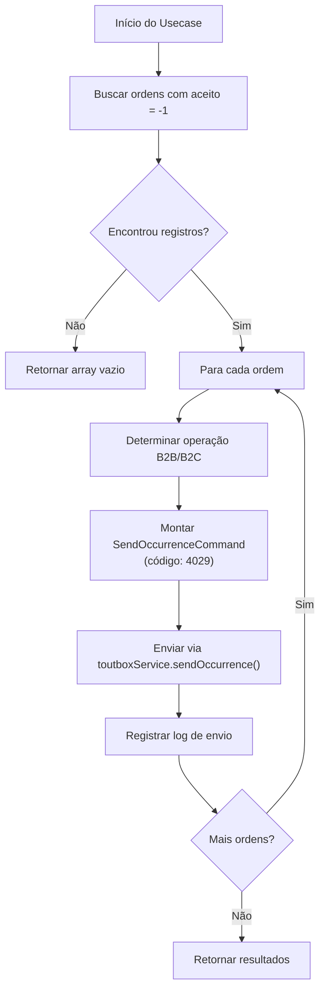

# PRD — declineOrderUsecase

## 1. Visão Geral

Criar um novo caso de uso (`declineOrderUsecase`) no domínio `preListaPostagem` que automatize o envio de ocorrências de **recusa de pedido** para o Toutbox.

O fluxo consiste em:

1. Consultar a tabela `pre_lista_postagem` para buscar todas as ordens com `aceito = -1`.
2. Iterar sobre os registros encontrados.
3. Para cada registro, montar e enviar uma ocorrência via `ToutboxService.sendOccurrence()` com:
   - **Código do evento:** `4029`
   - **Descrição:** `"Baixa a pedido da transportadora"`

---

## 2. Contexto Técnico

| Item | Detalhe |
|---|---|
| **Domínio** | `preListaPostagem` (`features/preListaPostagem`) |
| **Tabela** | `pre_lista_postagem` |
| **Coluna de filtro** | `aceito` (tipo `int`, default `0`) |
| **Valor de filtro** | `-1` (pedido recusado) |
| **Serviço de envio** | `ToutboxB2BService` / `ToutboxB2CService` (via `IToutboxService.sendOccurrence()`) |
| **Command existente** | `SendOccurrenceCommand` (`@shared/services/toutbox/command/sendOccurrence.command.ts`) |

### Dependências já existentes no projeto

- `DrizzlePreListaPostagemRepository` — repositório Drizzle para `pre_lista_postagem`.
- `ToutboxB2BService` / `ToutboxB2CService` — serviços que implementam `IToutboxService`.
- `SendOccurrenceCommand` — command para envio de ocorrência (contém `eventsData[].events[]` com `eventCode`, `description`, `date`, `address`, etc.).
- `HistoryLogsService` — para registrar logs de envio.
- `PreListaPostagemService` — serviço compartilhado para consultas na PLP.

---

## 3. Requisitos Funcionais

### RF-01 — Buscar pedidos recusados
- Consultar `pre_lista_postagem` filtrando `WHERE aceito = -1`.
- Retornar todas as colunas relevantes para montar a ocorrência (ao menos: `id`, `codigoUnico`, `numeroPedido`, `canal`, `entregaNome`, `entregaLogradouro`, `entregaBairro`, `entregaNumero`, `entregaCidade`, `entregaUf`, `entregaLat`, `entregaLon`, `entregaRastreio`).

### RF-02 — Determinar operação (B2B / B2C)
- Usar a mesma heurística existente no `SendOrderHistoryUsecase`: se `numeroPedido` (ou `codigoUnico`) iniciar com letra → `VIVO B2B`; caso contrário → `VIVO B2C`.
- Selecionar o `ToutboxService` correspondente via strategy.

### RF-03 — Montar e enviar a ocorrência
Para cada pedido recusado, criar um `SendOccurrenceCommand` com:

```typescript
{
  orderId: order.codigoUnico,       // ou numeroPedido conforme padrão
  events: [{
    eventCode: "4029",
    description: "Baixa a pedido da transportadora",
    date: <data/hora atual formatada>,
    address: `${order.entregaLogradouro}, ${order.entregaBairro}`,
    number: `${order.entregaNumero}`,
    city: `${order.entregaCidade}`,
    state: `${order.entregaUf}`,
    geo: {
      lat: parseFloat(order.entregaLat) || 0,
      long: parseFloat(order.entregaLon) || 0,
    }
  }]
}
```

Enviar via `toutboxService.sendOccurrence(command)`.

### RF-04 — Registrar log de envio
- Após cada envio (sucesso ou erro), registrar o log usando `HistoryLogsService.insertLog()` seguindo o mesmo padrão de `SendOrderHistoryUsecase`.

### RF-05 — Retornar resultados
- Retornar um array com o resultado de cada envio (sucesso/erro) para rastreabilidade.

---

## 4. Requisitos Não Funcionais

- **Idempotência:** considerar um mecanismo para evitar re-envio de ocorrências já processadas (ex: atualizar o campo `aceito` para outro status após o envio bem-sucedido, ou verificar logs anteriores).
- **Observabilidade:** usar `console.log` para acompanhar progresso (ex: `"Enviando decline ${counter} de ${total}"`).
- **Tratamento de erros:** capturar exceções por registro individual para que a falha em um pedido não interrompa o processamento dos demais.

---

## 5. Arquitetura — Arquivos a Criar / Modificar

### 5.1 Novos arquivos

| Arquivo | Descrição |
|---|---|
| `features/preListaPostagem/domain/usecase/declineOrder.usecase.ts` | Caso de uso principal |
| `features/preListaPostagem/domain/contracts/preListaPostagem.repository.interface.ts` | Interface do repositório (opcional, para desacoplar) |

### 5.2 Arquivos a modificar

| Arquivo | Modificação |
|---|---|
| `features/preListaPostagem/infra/repository/drizzlePreListaPostagem.repository.ts` | Adicionar método `findDeclinedOrders()` que retorna registros com `aceito = -1` |
| `@constants/toutboxOccurrencesMapping.ts` | Adicionar `BAIXA_PEDIDO_TRANSPORTADORA: 4029` |
| `index.ts` | Instanciar e executar o `DeclineOrderUsecase` com injeção de dependências (repository, toutboxStrategy, historyLogsService) |

---

## 6. Fluxo de Execução



---

## 7. Pontos de Decisão para o Desenvolvedor

> [!IMPORTANT]
> **O que fazer após o envio bem-sucedido?**
> Precisa-se decidir se, após o envio da ocorrência, o campo `aceito` deve ser atualizado para um novo valor (ex: `-2` ou outro) para evitar re-processamento em execuções futuras. Se sim, adicionar um método `updateDeclinedStatus()` ao repositório.

> [!IMPORTANT]
> **Qual campo usar como `orderId`?**
> O schema possui tanto `codigoUnico` quanto `numeroPedido`. Precisa alinhar qual deles será usado como `orderId` no `SendOccurrenceCommand`, seguindo o mesmo padrão do `SendOrderHistoryUsecase` (que usa `numero_ba`).

> [!NOTE]
> **TrackingNumber para B2B:**
> No fluxo B2B existente, o `orderId` é substituído por um `trackingNumber` consultado via `PreListaPostagemService.getTrackingNumber()`. Avaliar se o mesmo tratamento se aplica ao `declineOrderUsecase`.

---

## 8. Critérios de Aceite

- [ ] Ordens com `aceito = -1` são consultadas corretamente no banco
- [ ] Para cada ordem, uma ocorrência com código `4029` é enviada ao Toutbox
- [ ] A descrição da ocorrência é exatamente `"Baixa a pedido da transportadora"`
- [ ] Logs de envio são registrados (sucesso e erro)
- [ ] Falhas individuais não interrompem o processamento das demais ordens
- [ ] O usecase é registrado e executado via `index.ts`

---

## 9. Estimativa

| Atividade | Complexidade |
|---|---|
| Método `findDeclinedOrders()` no repository | Baixa |
| `DeclineOrderUsecase` | Média |
| Wiring no `index.ts` | Baixa |
| Constante no mapping | Trivial |
| **Total estimado** | **~2-3h de desenvolvimento** |
